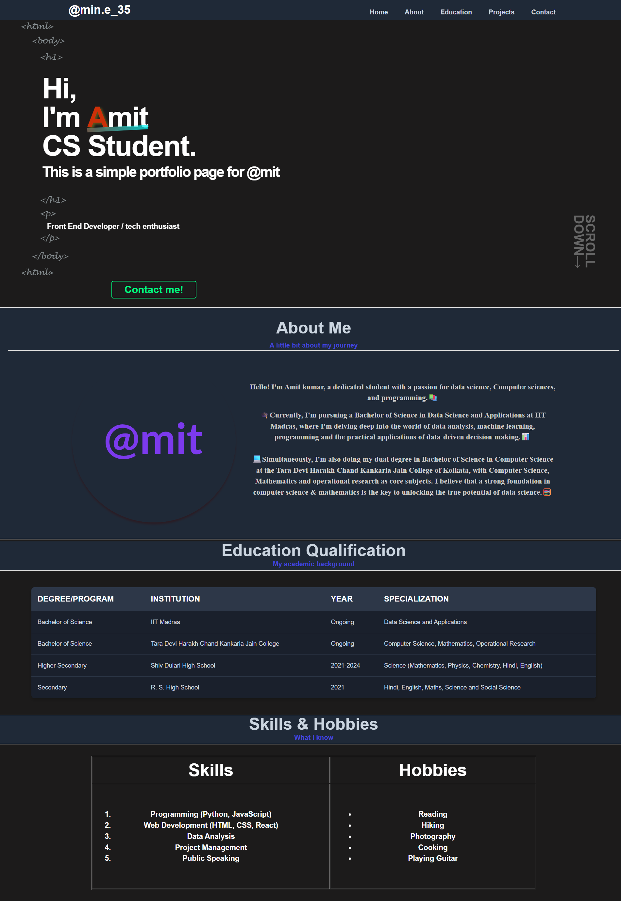

# min.e_35_portfolio
This code outlines a responsive personal portfolio website for Amit, a student of Data Science and Computer Science. It formally presents his academic qualifications, skills, and hobbies, alongside a professional introduction.
Amit's Personal Portfolio
This repository contains the source code for the personal portfolio website of Amit, a student specializing in Data Science and Computer Science. The website serves as a professional showcase of his academic journey, technical skills, and personal interests.

Features
Responsive Design: Optimized for seamless viewing across various devices, from desktops to mobile phones.

Navigation Bar: A sticky header with links for easy access to different sections: Home, About, Education, Projects, and Contact.

Hero Section: An engaging introduction to Amit, highlighting his name, current academic status, and a call to action for contact.

About Me Section: Provides a detailed overview of Amit's educational background and passion for Data Science and Computer Science, featuring a profile image.

Education Qualification: Presents a structured table of Amit's academic degrees and programs from various institutions.

Skills & Hobbies: A clear breakdown of Amit's technical proficiencies (e.g., Programming, Web Development) and personal interests (e.g., Reading, Hiking).

Technologies Used
HTML5: Structures the content of the web pages.

CSS3: Styles the website, including responsive design elements.

Setup and Usage
To view this portfolio locally:

Clone the repository:

Bash

git clone <repository-url>
Navigate to the project directory:

Bash

cd <repository-name>
Open index.html:
Simply open the index.html file in your preferred web browser.

Screenshort
# Amit's Personal Portfolio
Here's a look at the homepage:

Contact
For inquiries or collaborations, please refer to the "Contact" section on the website, or reach out via the provided Instagram link in the hero section.
